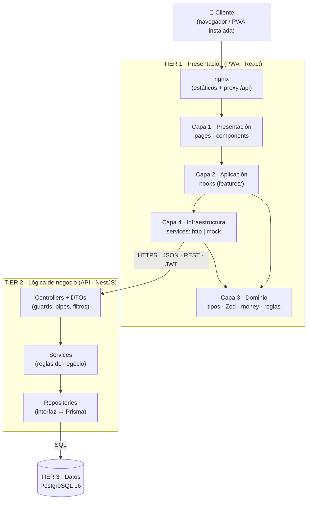

# 🐷 Chanchito — Gestor Económico Personal

**Chanchito** es una aplicación web progresiva (PWA) para llevar tus finanzas personales: registra ingresos y gastos, controla deudas (lo que debes y lo que te deben), define metas de ahorro, consulta estadísticas y descarga reportes mensuales.

Además de ser una herramienta útil, el proyecto es una **implementación práctica de la arquitectura en N-Capas (Layered / N-Layer Architecture)** y de los principios **SoC, SOLID, KISS y YAGNI**, tal como se explican en el artículo de Mehmet Ozkaya citado al final.

---

## Índice

1. [¿Qué hace el sistema?](#1-qué-hace-el-sistema)
2. [Stack tecnológico](#2-stack-tecnológico)
3. [Arquitectura: cómo se aplica el artículo](#3-arquitectura-cómo-se-aplica-el-artículo)
4. [Principios de diseño aplicados](#4-principios-de-diseño-aplicados)
5. [Decisiones de diseño relevantes](#5-decisiones-de-diseño-relevantes)
6. [Estructura del repositorio](#6-estructura-del-repositorio)
7. [Cómo ejecutarlo](#7-cómo-ejecutarlo)
8. [API REST (resumen)](#8-api-rest-resumen)
9. [Pruebas](#9-pruebas)
10. [Modo Mock y migración a API real](#10-modo-mock-y-migración-a-api-real)
11. [Alcance y evolución futura](#11-alcance-y-evolución-futura)
12. [Referencias](#12-referencias)

---

## 1. ¿Qué hace el sistema?

| Módulo | Funcionalidad |
|---|---|
| **Cuentas** | Registro, inicio de sesión (JWT con renovación), onboarding con saldo inicial y moneda. |
| **Ingresos y gastos** | Alta, edición y borrado de movimientos con categoría, fecha y descripción. Categorías predefinidas (Sueldo, Mesada, Comida, Transporte…) y categorías propias. |
| **Deudas** | Dos sentidos: **"Yo debo"** (egresos futuros) y **"Me deben"** (ingresos futuros). Registro de pagos/cobros parciales, saldo pendiente, vencimientos, y préstamos recibidos que generan deuda automáticamente. |
| **Metas de ahorro** | Meta con monto objetivo y fecha límite, aportes, barra de progreso porcentual y sugerencia de ahorro mensual. |
| **Dashboard** | KPIs (saldo actual, gastos del mes, total ahorrado, deudas), gráfico circular de gastos por categoría, barras de ingresos vs. gastos y línea de tendencia de ahorro. |
| **Historial** | Lista paginada por mes, con filtros por tipo, categoría y texto. |
| **Reportes** | Descarga del reporte mensual en **CSV** o **PDF**. |
| **Zona de peligro** | Vaciado del historial (total o por rango de fechas) con **doble confirmación** (casilla + escribir `BORRAR`). |
| **PWA** | Instalable en el celular, precaché del shell, lectura offline de los últimos datos y aviso de conexión. |

**Regla central del balance:**

```
Saldo actual = saldo inicial + Σ ingresos − Σ gastos
```

Los pagos de deuda y los aportes a metas pueden reflejarse en el balance creando un movimiento espejo, por lo que el saldo es siempre **calculado** (nunca guardado) y no se desincroniza.

---

## 2. Stack tecnológico

| Capa | Tecnología |
|---|---|
| Frontend | React 18 + TypeScript (`strict`) + Vite + Tailwind CSS + shadcn/ui |
| Estado y datos | TanStack Query (servidor), Zustand (UI), React Hook Form + Zod (formularios) |
| Gráficos | Recharts |
| PWA | `vite-plugin-pwa` (Workbox) |
| Backend | Node.js + NestJS (TypeScript) |
| Acceso a datos | Prisma ORM detrás de interfaces de repositorio |
| Base de datos | PostgreSQL 16 (`NUMERIC(14,2)` para dinero) |
| Auth | JWT (access + refresh con rotación) + `argon2` |
| Reportes | `fast-csv` y `pdfkit` |
| Infraestructura | Docker Compose (`db`, `api`, `web` con nginx) |

---

## 3. Arquitectura: cómo se aplica el artículo

El artículo *Layered (N-Layer) Architecture* plantea que una aplicación N-Capas **particiona la lógica de la aplicación en capas específicas** y que esas capas son **lógicas**: se desarrollan aisladas, pero pueden separarse en **tiers físicos** distintos. Las capas más comunes que menciona son **interfaz de usuario, lógica de negocio y acceso a datos**, que corresponden a un *presentation tier* (una web app), un *business tier* (casos de uso expuestos como REST API) y un *data tier* (base de datos SQL).

Chanchito sigue ese modelo de forma literal:

### 3.1 Del diagrama del artículo a Chanchito

| Artículo (e-commerce) | Chanchito (finanzas personales) |
|---|---|
| UI (Angular / React / Vue) | **PWA en React** (tier 1) |
| Backend con la lógica en servicios (Catalog, Discount, Order…) | **API NestJS** con módulos por dominio: `transactions`, `debts`, `goals`, `dashboard`, `reports`… (tier 2) |
| RDBMS (Oracle / PostgreSQL / MySQL) | **PostgreSQL 16** (tier 3) |
| Load Balancer (Apache / NGINX) | **nginx** delante de la app: sirve la PWA y hace de proxy inverso de `/api` hacia el backend |
| Un solo artefacto de aplicación (monolito en capas) | Un solo backend desplegable (monolito modular), **sin microservicios** |

> Nota honesta: en Chanchito nginx cumple el rol de proxy inverso/punto de entrada, no reparte carga entre varias réplicas. El diseño lo permite (la API es *stateless* gracias a JWT), pero una sola instancia es suficiente para un uso personal.

### 3.2 Diagrama general



### 3.3 Capas lógicas vs. tiers físicos

El artículo insiste en la diferencia entre **layers** (separación lógica) y **tiers** (separación física). En Chanchito:

- **Capas lógicas:** presentación, aplicación, dominio e infraestructura en el cliente; controladores, servicios y repositorios en el servidor.
- **Tiers físicos:** tres contenedores independientes en `docker-compose.yml` — `web` (PWA estática), `api` (NestJS) y `db` (PostgreSQL).

### 3.4 Responsabilidad de cada capa del backend

| Capa | Hace | No hace |
|---|---|---|
| **Controller** (presentación de la API) | Recibe HTTP, valida el DTO, extrae el usuario del token, llama al servicio y responde. | Reglas de negocio ni SQL. |
| **Service** (negocio) | Reglas como "un pago no puede superar el saldo pendiente", cálculo del balance, progreso de metas, estadísticas y orquestación de transacciones atómicas. | Conocer HTTP, JSON ni el ORM. |
| **Repository** (acceso a datos) | Consultas y persistencia detrás de interfaces; agregaciones SQL. | Decidir reglas de negocio. |

```
Controller ──► Service ──► Repository (INTERFAZ) ◄── PrismaRepository
   (HTTP)     (negocio)        (puerto)                (adaptador)
```

La dependencia solo va **hacia abajo**, y el servicio depende de **abstracciones**, nunca de Prisma. Un filtro global de excepciones traduce los errores de dominio (`NotFoundError`, `BusinessRuleError`, `ConflictError`) al formato JSON estándar de la API.

### 3.5 El frontend también está en capas

El cliente replica la misma separación, a menor escala:

```
pages/  (presentación)  ──►  features/ (hooks = casos de uso)  ──►  services/ (ports · http · mock)
                                              │                              │
                                              └──────────► domain/ ◄─────────┘
                                                    (TypeScript puro)
```

Regla de dependencias (validada con una regla de ESLint `no-restricted-imports`):

| Desde ↓ / Hacia → | pages | components | features | services | domain |
|---|:-:|:-:|:-:|:-:|:-:|
| **pages** | — | ✅ | ✅ | ❌ | ✅ |
| **components** | ❌ | ✅ | ✅ (solo hooks) | ❌ | ✅ |
| **features** | ❌ | ❌ | ✅ | ✅ (solo `ports`) | ✅ |
| **services** | ❌ | ❌ | ❌ | ✅ | ✅ |
| **domain** | ❌ | ❌ | ❌ | ❌ | ✅ |

Ningún componente ni página importa `axios`, `fetch` ni `idb-keyval`: solo consumen hooks.

---

## 4. Principios de diseño aplicados

El artículo enumera **KISS, YAGNI, SoC y SOLID** como principios que deben guiar el diseño. Así se aplicó cada uno.

### 4.1 Separation of Concerns (SoC)

El artículo explica que cada elemento del software debe tener sus propias responsabilidades y que hay que buscar **bajo acoplamiento y alta cohesión**. En Chanchito:

- **Módulos por dominio** (alta cohesión): cada carpeta de `backend/src/modules/` agrupa controlador, DTOs, servicio y repositorio de un solo tema.
- **Bajo acoplamiento:** los módulos se comunican por interfaces, y el frontend solo conoce puertos (`TransactionsApi`, `DebtsApi`…), no implementaciones.
- **Separación por componente, no solo por tecnología:** en el frontend cada componente encapsula su propia estructura, estilo y comportamiento (el mismo enfoque que el artículo ilustra con el ejemplo de botón, date picker o modal).

### 4.2 SOLID

| Principio | Cómo se aplica en Chanchito |
|---|---|
| **S** — Responsabilidad Única | `DebtsService` solo gestiona deudas; `ReportsService` solo genera reportes; `DashboardService` solo lee estadísticas. Los controladores son delgados. En el cliente: un componente = una responsabilidad visual, un hook = un caso de uso. |
| **O** — Abierto/Cerrado | Los reportes usan el patrón **Strategy**: `ReportExporter` con `CsvExporter` y `PdfExporter`. Añadir Excel es crear un `XlsxExporter` y registrarlo, **sin tocar el código existente**. En el cliente ocurre lo mismo con `ReportDownloader`. |
| **L** — Sustitución de Liskov | `PrismaTransactionRepository` e `InMemoryTransactionRepository` (usado en tests) son intercambiables; también `CsvExporter`/`PdfExporter`. En el frontend, `Mock*Api` y `Http*Api` implementan el mismo contrato y se validan con la **misma suite de pruebas**. Es el equivalente a "cambiar RabbitMQ por Kafka abstrayendo el Event Bus" del artículo. |
| **I** — Segregación de Interfaces | Interfaces pequeñas: `TransactionReader` (consultas del dashboard) y `TransactionWriter` (escritura), en lugar de un repositorio gigante; en el cliente una interfaz por recurso, no un `Api` monolítico. |
| **D** — Inversión de Dependencias | Los servicios reciben abstracciones por **inyección** (`TRANSACTION_READER`, `TRANSACTION_WRITER`, `UNIT_OF_WORK`, `CLOCK`). En el cliente, los hooks obtienen los servicios vía `useServices()` (React Context). |

```ts
// Ejemplo real del patrón (backend)
@Injectable()
export class TransactionsService {
  constructor(
    @Inject(TRANSACTION_READER) private readonly reader: TransactionReader,
    @Inject(TRANSACTION_WRITER) private readonly writer: TransactionWriter,
    @Inject(UNIT_OF_WORK) private readonly uow: UnitOfWork,
    @Inject(CLOCK) private readonly clock: Clock,
  ) {}
}
```

### 4.3 KISS y YAGNI

| Decisión | Motivo |
|---|---|
| **Monolito modular** en vez de microservicios | Para uso personal, la complejidad de mensajería y servicios distribuidos no aporta valor. |
| **Una sola tabla `transactions`** para ingresos y gastos | Evita duplicar esquema; el tipo distingue el signo. |
| Sin Redux, sin CQRS, sin eventos | TanStack Query + Zustand cubren todo. |
| **Cola de escritura offline no implementada** | La v1 solo permite lectura offline; se dejó una interfaz `OutboxPort` sin implementar como punto de extensión. |
| Sin multi-idioma ni conversión de monedas | No se necesitan para el caso de uso actual. |

---

## 5. Decisiones de diseño relevantes

1. **Los saldos se calculan, no se guardan.** Balance general, saldo de una deuda (`principal − Σ pagos`) y progreso de una meta (`Σ aportes / objetivo`) se derivan del historial, que es la única fuente de verdad.
2. **Dinero sin `float`.** BD con `NUMERIC(14,2)`; API y cliente con *strings* decimales (`"1250.50"`); el frontend opera en centavos enteros (`domain/money.ts`).
3. **Movimientos espejo.** Un pago de deuda o un aporte a meta puede crear su movimiento correspondiente (`DEBT_PAYMENT`, `DEBT_COLLECTION`, `SAVINGS`) en una transacción atómica; al borrar el pago se borra el espejo.
4. **Préstamos.** Un ingreso de categoría "Préstamo" crea o vincula una deuda `I_OWE` de forma atómica.
5. **Seguridad.** Contraseñas con argon2, refresh tokens con rotación y almacenados hasheados, `helmet`, CORS con lista blanca, *rate limiting* en login/registro, validación estricta de DTOs y filtrado por `user_id` en toda consulta (un recurso ajeno responde `404`).
6. **Adaptador Mock intercambiable.** El frontend puede funcionar sin backend (datos en IndexedDB) y pasar a la API real cambiando solo variables de entorno.
7. **Diseño de interfaz.** Paleta esmeralda, tipografía Inter, importes con `tabular-nums`, modo claro/oscuro y enfoque *mobile-first*.

---

## 6. Estructura del repositorio

```
chanchito/
├── docker-compose.yml
├── .env.example
├── README.md
├── docs/                    # DECISIONS.md, ACCEPTANCE.md, openapi.json, design/
├── backend/
│   ├── prisma/              # schema.prisma, migraciones, seed
│   └── src/
│       ├── common/          # errores, guards, Clock, UnitOfWork, money
│       └── modules/         # auth · users · categories · transactions
│                            # debts · goals · dashboard · reports · health
└── frontend/
    └── src/
        ├── app/             # providers, router, guards
        ├── domain/          # TypeScript puro: modelos, Zod, money, reglas
        ├── services/        # ports · http · mock · createServices
        ├── features/        # hooks por dominio (casos de uso)
        ├── components/      # ui, layout, common, charts, transactions, debts, goals
        ├── pages/           # Login, Dashboard, Historial, Deudas, Metas, Ajustes…
        └── pwa/             # service worker, instalación, estado de conexión
```

---

## 7. Cómo ejecutarlo

### Requisitos
Docker y Docker Compose. Para desarrollo local: Node.js 22 LTS.

### Con Docker (recomendado)

```bash
git clone <URL-DEL-REPOSITORIO>
cd chanchito
cp .env.example .env        # cambia los secretos JWT antes de usarlo en serio
docker compose up --build
```

| Servicio | URL |
|---|---|
| Aplicación (PWA) | http://localhost:8080 |
| API | http://localhost:3000/api/v1 |
| Documentación Swagger | http://localhost:3000/api/docs |

### Desarrollo local

```bash
# Base de datos
docker compose up -d db

# Backend
cd backend
npm install
npx prisma migrate deploy
npx prisma db seed          # opcional: datos demo
npm run start:dev

# Frontend (en otra terminal)
cd frontend
npm install
npm run dev                 # http://localhost:5173
```

### Datos demo
Tras ejecutar el seed: usuario **`demo@chanchito.app`** · contraseña **`Demo1234`**, con movimientos, deudas y metas de ejemplo.

### Variables de entorno principales

| Variable | Descripción |
|---|---|
| `DATABASE_URL` | Cadena de conexión de PostgreSQL |
| `JWT_ACCESS_SECRET` / `JWT_REFRESH_SECRET` | Secretos de firma (≥ 32 caracteres) |
| `CORS_ORIGINS` | Orígenes permitidos para la PWA |
| `APP_TIMEZONE` | Zona horaria para calcular "hoy" (por defecto `America/Lima`) |
| `VITE_DATA_SOURCE` | `mock` o `http` |
| `VITE_API_BASE_URL` | URL base de la API (por defecto `/api/v1`) |

---

## 8. API REST (resumen)

Base: `/api/v1` · JSON `camelCase` · autenticación `Authorization: Bearer <token>`. El detalle completo está en Swagger y en `docs/openapi.json`.

| Recurso | Endpoints principales |
|---|---|
| Auth | `POST /auth/register`, `/auth/login`, `/auth/refresh`, `/auth/logout` |
| Usuario | `GET/PUT /users/me` |
| Categorías | `GET/POST /categories`, `PUT/DELETE /categories/:id` |
| Movimientos | `GET/POST /transactions`, `GET/PUT/DELETE /transactions/:id`, `DELETE /transactions?confirm=true` (vaciar historial) |
| Deudas | `GET/POST /debts`, `GET/PUT/DELETE /debts/:id`, `POST /debts/:id/payments`, `DELETE /debts/:id/payments/:paymentId` |
| Metas | `GET/POST /goals`, `GET/PUT/DELETE /goals/:id`, `POST /goals/:id/contributions`, `DELETE /goals/:id/contributions/:contributionId` |
| Dashboard | `GET /dashboard/summary`, `/dashboard/expenses-by-category`, `/dashboard/monthly-trend` |
| Reportes | `GET /reports/monthly?month=YYYY-MM&format=csv\|pdf` |

Todos los errores comparten el mismo formato:

```json
{ "status": 422, "code": "BUSINESS_RULE_VIOLATION",
  "message": "El pago no puede superar el saldo pendiente.",
  "details": [ { "field": "amount", "message": "Máximo permitido: 300.00" } ] }
```

---

## 9. Pruebas

```bash
# Backend
cd backend
npm test            # unitarias (reglas de dominio y servicios con repositorios en memoria)
npm run test:e2e    # integración con PostgreSQL

# Frontend
cd frontend
npm test            # dominio (money, reglas, esquemas Zod) y suite de contrato
```

La **suite de contrato** ejecuta las mismas pruebas contra el adaptador Mock y contra el adaptador HTTP, verificando en la práctica el principio de sustitución de Liskov.

---

## 10. Modo Mock y migración a API real

El frontend consume servicios mediante interfaces (*ports*). Una fábrica (`createServices`) elige la implementación según `VITE_DATA_SOURCE`:

- `mock` → datos en IndexedDB que se comportan como el backend (mismas reglas, latencia y errores simulados).
- `http` → llamadas reales a la API con Axios, interceptores de token y renovación automática.

Para pasar de Mock a API real:

1. Definir `VITE_DATA_SOURCE=http` y `VITE_API_BASE_URL`.
2. Verificar que `CORS_ORIGINS` incluya el origen de la PWA.
3. Ejecutar la suite de contrato contra el backend.
4. Ajustar solo los *mappers* si los nombres de campos difieren.
5. Confirmar que `Content-Disposition` está expuesto para las descargas.

Ningún componente ni página cambia.

---

## 11. Alcance y evolución futura

**Fuera de alcance de la v1 (por YAGNI):** cola de escritura offline con sincronización, multi-idioma, conversión entre monedas, adjuntos o recibos, presupuestos por categoría, movimientos recurrentes, notificaciones push, importación de extractos bancarios y autenticación social.

**Sobre la evolución a microservicios.** El artículo cierra explicando que, si el negocio crece y la arquitectura en capas ya no alcanza (por ejemplo, para soportar más peticiones concurrentes), el siguiente paso es evolucionar hacia microservicios. Chanchito **no lo necesita** por ser de uso personal, pero la separación de módulos por dominio, los repositorios tras interfaces y la API *stateless* dejan ese camino abierto sin reescribir la lógica de negocio.

---

## 12. Referencias

- Mehmet Ozkaya. **"Layered (N-Layer) Architecture"**. *Design Microservices Architecture with Patterns & Principles*, Medium, 6 de septiembre de 2021. Base conceptual de este proyecto: capas lógicas vs. tiers físicos, SoC, SOLID, KISS y YAGNI.

---
