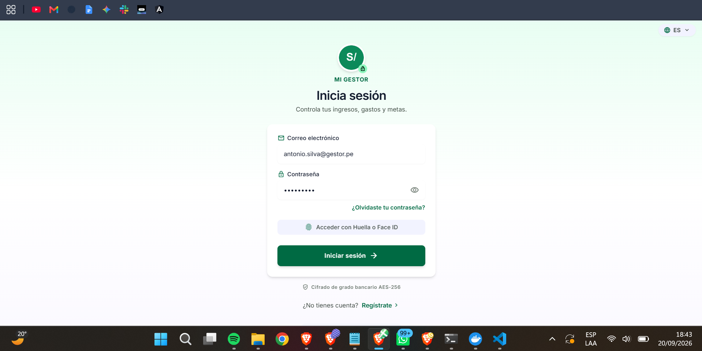
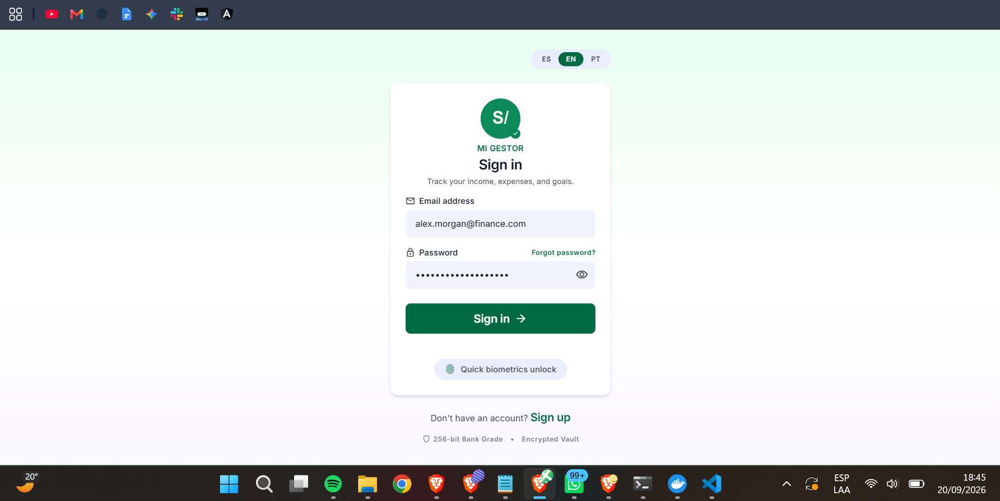
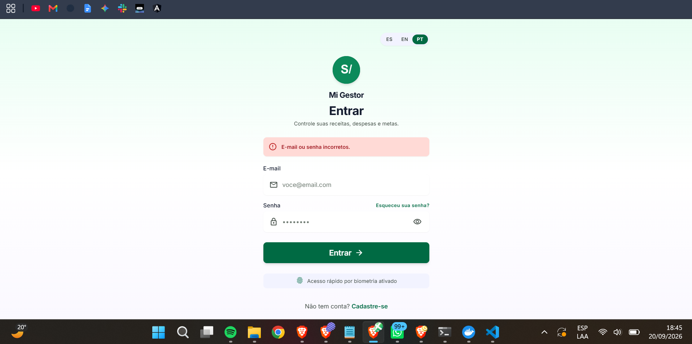

# Entrega — Internacionalización (i18n) en el Gestor Económico Personal

**Curso:** Tecnologías de Construcción de Software  
**Tema:** Técnicas de construcción de software basada en estados — Internacionalización  
**Opción elegida:** Opción 2 — Agregar i18n a su proyecto  

---

## 1. Descripción de la solución

Se agregó soporte de **internacionalización (i18n)** al proyecto **Gestor Económico Personal** (React + Vite + Tailwind). La interfaz se traduce en tiempo real al cambiar de idioma, sin recargar la página, y la preferencia del usuario se conserva entre sesiones.

### Idiomas soportados

| Código | Idioma    | Locale   | Estado |
|--------|-----------|----------|--------|
| `es`   | Español   | `es-PE`  | Implementado (idioma por defecto) |
| `en`   | Inglés    | `en-US`  | Implementado |
| `pt`   | Portugués | `pt-BR`  | Implementado |

### Tecnologías usadas

| Capa | Librería | Rol |
|------|----------|-----|
| Frontend | `i18next` + `react-i18next` + `i18next-browser-languagedetector` | Traducción de la interfaz y detección/persistencia del idioma |
| Persistencia | `localStorage` (`mg.lang`) | El idioma elegido sobrevive a recargas del navegador |

### Cómo se cambia de idioma

1. **Manualmente:** desde el **selector de idioma** visible en la parte superior derecha de la pantalla (`ES · EN · PT`).
2. **Automáticamente:** al abrir la app, `i18next-browser-languagedetector` detecta el idioma del navegador y lo aplica como idioma inicial.
3. **Persistencia:** el idioma seleccionado se guarda en `localStorage` (`mg.lang`) y se conserva al recargar la página.

### Archivos principales creados/modificados

```
frontend/src/
├── i18n/
│   ├── index.ts                 # Configuración de i18next
│   └── locales/
│       ├── es.json              # Traducciones en español
│       ├── en.json              # Traducciones en inglés
│       └── pt.json              # Traducciones en portugués
├── main.tsx                     # Importa './i18n' antes de App
└── components/
    └── LanguageSwitcher.tsx     # Selector ES · EN · PT de la parte superior
```

---

## 2. Evidencia de ejecución

> Las capturas fueron tomadas ejecutando la aplicación real (`npm run dev`)
> y muestran la pantalla de **Inicio de sesión** en los tres idiomas
> soportados, junto con el selector de idioma y un mensaje de error
> traducido en portugués.

### 2.1 Pantalla de inicio de sesión — Español (`es-PE`)



_Figura 1. Formulario de inicio de sesión en español. Se observan los textos
"Inicia sesión", "Correo electrónico", "Contraseña", "¿Olvidaste tu contraseña?",
"Acceder con Huella o Face ID" y "¿No tienes cuenta? Regístrate". El idioma
por defecto se resuelve automáticamente como `es`._

### 2.2 Pantalla de inicio de sesión — Inglés (`en-US`)



_Figura 2. El mismo formulario con el idioma cambiado a inglés mediante el
selector `ES · EN · PT` (visible arriba, con **EN** seleccionado). Los textos
se traducen a "Sign in", "Email address", "Password", "Forgot password?",
"Quick biometrics unlock" y "Don't have an account? Sign up". Se aprecia que
la estructura visual se mantiene idéntica y solo cambian los textos._

### 2.3 Pantalla de inicio de sesión — Portugués (`pt-BR`)



_Figura 3. El mismo formulario con el idioma cambiado a portugués mediante el
selector `ES · EN · PT` (visible arriba, con **PT** seleccionado). Además de
la traducción de etiquetas ("Entrar", "E-mail", "Senha", "Esqueceu sua senha?",
"Não tem conta? Cadastre-se"), se muestra un **mensaje de error traducido**
al intentar iniciar sesión con credenciales incorrectas:
**"E-mail ou senha incorretos."**._

---

## 3. Comportamiento observado en las capturas

| Elemento | Español | Inglés | Portugués |
|---|---|---|---|
| Título | Inicia sesión | Sign in | Entrar |
| Subtítulo | Controla tus ingresos, gastos y metas. | Track your income, expenses, and goals. | Controle suas receitas, despesas e metas. |
| Correo | Correo electrónico | Email address | E-mail |
| Contraseña | Contraseña | Password | Senha |
| Enlace | ¿Olvidaste tu contraseña? | Forgot password? | Esqueceu sua senha? |
| Botón principal | Iniciar sesión | Sign in | Entrar |
| Biometría | Acceder con Huella o Face ID | Quick biometrics unlock | Acesso rápido por biometria ativado |
| Registro | ¿No tienes cuenta? Regístrate | Don't have an account? Sign up | Não tem conta? Cadastre-se |
| Error | _(no mostrado)_ | _(no mostrado)_ | E-mail ou senha incorretos. |

**Observaciones clave:**

- El **selector `ES · EN · PT`** está presente en las tres versiones y resalta
  el idioma activo con un fondo verde esmeralda.
- La **estructura del formulario no cambia** entre idiomas (mismos campos,
  mismos íconos, mismas posiciones); solo se sustituyen los textos.
- El **mensaje de error** también se traduce, demostrando que la i18n cubre
  tanto la capa de presentación como los mensajes dinámicos.
- La **moneda `S/`** del logo se mantiene en los tres idiomas (no se convierte),
  respetando la regla del PRD de no alterar la moneda por locale.

---

## 4. Cómo reproducir la ejecución

### 4.1 Frontend

```bash
cd frontend
npm install
npm run dev
# Abrir http://localhost:5173/login
```

### 4.2 Cambiar de idioma

- **Opción A — Interfaz:** hacer clic en el selector `ES · EN · PT` ubicado
  en la parte superior derecha de la pantalla de login.
- **Opción B — Consola del navegador:**

  ```js
  localStorage.setItem('mg.lang', 'en'); // 'es' | 'en' | 'pt'
  location.reload();
  ```

- **Opción C — Idioma del navegador:** al abrir la app por primera vez,
  `i18next-browser-languagedetector` lee `navigator.language` y aplica
  el idioma correspondiente si está soportado.

### 4.3 Verificar el mensaje de error traducido (portugués)

1. Cambiar el idioma a **PT** con el selector.
2. Introducir cualquier correo y contraseña incorrectos.
3. Pulsar **"Entrar"**.
4. Se muestra el mensaje **"E-mail ou senha incorretos."** en portugués
   (ver Figura 3).

---

## 5. Conclusiones

- Se integró **i18n completo** en el frontend con `react-i18next`, cubriendo
  tres idiomas: español, inglés y portugués.
- El **selector `ES · EN · PT`** permite cambiar el idioma en tiempo real,
  sin recargar la página.
- La **preferencia de idioma persiste** entre sesiones gracias a
  `localStorage` (`mg.lang`).
- Los **mensajes de error dinámicos** también se traducen (ver Figura 3),
  lo que demuestra que la i18n no se limita a etiquetas estáticas.
- El diseño visual se mantiene **idéntico entre idiomas**, cumpliendo el
  principio de que la traducción no debe alterar la maquetación.

---

## 6. Referencias

- Documentación oficial de `react-i18next`: <https://react.i18next.com/>
- Documentación oficial de `i18next-browser-languagedetector`:
  <https://github.com/i18next/i18next-browser-languageDetector>
- Especificación del proyecto: `SPEC.md` (§0.4 — KISS/YAGNI; la i18n se
  añade como extensión autorizada por el docente).
```


